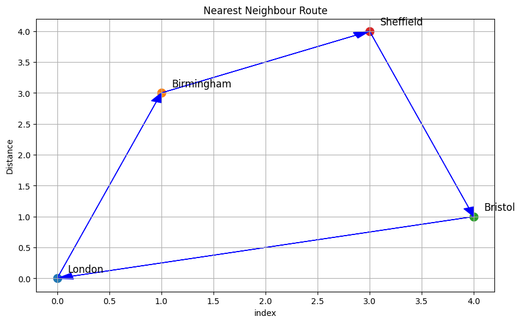

# Travelling Saleman Problem in Python

TSP seeks the shortest possible route that visits every node once. The goal is to keep both travel cost and distance as low as possible. Therefore, this is highly applicable in areas such as logistics in planning and optimisations for delivery services

## Implementation techniques

- Brute force
- Greedy algorithm
- Genetic algorithm
- Nearest neighbour

We have chosen to use the Nearest neigbour approach although, you can implement other algorithms.

## Steps of implementation

1. **Starting point** choosing an initial city as the starting point, in our case we start from London

2. **Initialisation** Create a list of to keep track of the route as well as a set to keep track of visited cities

3. **Visit nearest city** From current city, find nearest unvisited city. Append this to the route and mark this city as visited. Move to this city and make it your current city

4. Repeat step 3 until all cities have been visited

5. **Return to starting point** After visiting all city, return to inital city to complete the tour

The result of our programme is the following
Best route: ['London', 'Birmingham', 'Sheffield', 'Bristol', 'London']
Total Distance: 80

## Visualising the algorithm

Below is a visualisation of the Nearest Neighbour Route

